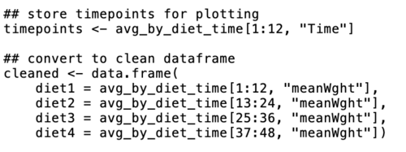
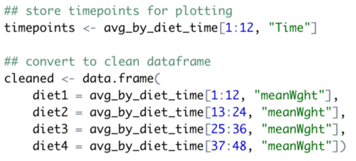

# The toolbox {#toolbox}

## Embarking on Data Science

The picture below represents data science in 1918: it probably tool a clerk a day to generate the figure.


But disregarding the time investment: This is data science. You collect data (in this case, Influenza mortality), look for patterns and try to find underlying mechanisms that may explain the patterns (Age, Gender, Marital Status).

([source](https://www.nytimes.com/2020/04/02/nyregion/spanish-flu-nyc-virus.html))

## Why do statistical programming?

Since you're a life science student -that is my target audience at least-, you have probably worked with Excel or SPSS at some time. Have you ever wondered  

- Why am I doing this exact same series of mouse clicks again and again? Is there not a more efficient way?
- How can I describe my work reproducible as a series of mouse clicks?

If so, then R may be your next favorite data analysis tool.
It takes a little effort at first, but once you get the hang of it you will never create a plot in Excel again. 

With R - as with any programming language, 

- Redoing an analysis or generating a report with minor adjustments is a breeze
- The analysis is central, not the output. This guarantees complete reproducibility


### Overview of the toolbox {-}

This chapter will introduce you to a toolbox that will serve you well during your data quests.  
It consists of 

- The R programming language and built-in functionality
- The RStudio Integrated Development Environment (IDE)
- R Markdown as documenting and reporting tool


## Tool 1: The R programming language


Nobody likes to pay for computer tools. Furtunately, R is completely free. Moreover, it is completely open source. This is of course one of the main reasons for its popularity; other statistical tools are not free and sometimes downright expensive.  
Besides this free nature, R is very popular because it has an interactive mode. We call this a read–evaluate–print loop: REPL. This means you don't need to write programs to run code. You simply type a command in the **_console_**, press enter and immediately get the result on the line below.  

As stated above, because you store your analyses in code, repeating these analyses -possibly with with new data or changed settings- is very easy.  
One of my personal favorite features is that R supports "literate programming" for creating presentations (such as this one!) and other publications (reports, papers etc). Pdf documents, Microsoft Word documents, web pages (html) and e-books are all possible outputs of a single R Markdown master document.  

Finally, R has advanced embedded graphical support. This means that graphical output (a plot) is as easy to generate as textual output! That said, the base plotting system of R should be considered deprecated and only used for quick inspections. The de facto standard is the ggplot2 plotting library.

Here are some figures to whet your appetite. You will probably be able to create all of these yourself at the end of this course.

```{r toolbox-facetting, fig.asp=.75, out.width='80%', fig.align='center', echo = FALSE, fig.cap='A facetplot - multiple similar plots split over a single nominal or ordinal variable'}
library(ggplot2)
airquality$Month <- factor(airquality$Month, levels = 5:9, labels = month.name[5:9])

ggplot(data = na.omit(airquality), mapping = aes(x = Solar.R, y = Ozone)) +
    geom_smooth(method="lm", formula = 'y ~ x') +
    geom_point(aes(color = Month), alpha = 0.7) + facet_wrap(. ~ Month)
```

```{r toolbox-polarplot, fig.asp=0.6, out.width='80%', fig.align='center', echo = FALSE, fig.cap = 'A polar plot - the dimensions are not your normal 2d x and y'}
# function to compute standard error of mean
se <- function(x) sqrt(var(x)/length(x)) 

DF <- data.frame(variable = as.factor(1:10), value = log2(2:11))

ggplot(DF, aes(variable, value, fill = variable)) +
    geom_bar(width = 1, stat = "identity", color = "white") +
    geom_errorbar(aes(ymin = value - se(value), 
                      ymax = value + se(value), 
                      color = variable), 
                      width = .2) + 
    scale_y_continuous(breaks = 0:nlevels(DF$variable)) +
    coord_polar() 
```


## Tool 2: RStudio as development environment


RStudio is a so-called Integrated Development Environment. This means it is a "Swiss Multitool" for programming. With it, you manage and run code, files, documentation on the language (help pages), building different output formats. 
The workbench has several panels and looks like this when you run the application.


You primarily work with 4 panels of the workbench:

1. **Code editor** where you write your scripts and R Markdown documents: text files with code you want to execute more than once
2. **R console** where you execute lines of code one by one
3. **Environment and History** See what data you have in memory, and what you have done so far
4. **Plots, Help & Files** 

You use the console to do basic calculations, try pieces of code, develop a function, or load scripts (from the code editor) into memory. On the other hand, the code editor is used to work on code that has life span longer than a few minutes: analyses you may want to repeat, or develop further in the form of scripts and R Markdown documents. 
The code editor supports many file types for viewing and editing: regular text, structured datafiles (text, csv, data files), scripts (programs), and analytical notebooks (R Markdown).  

What is nice about the **_code editor_** above regular text editors such as Notepad, Wordpad, TextEdit, is that it knows about different file types and their constituting elements and helps your read, write (auto-complete, error alerts), scan and organize them by displaying these elements using coloring, font types and other visual aids.

Here is the same piece of code, which is a plain text file, in two different editors. First as plain text in the Mac TextEdit app and next in the RStudio code editor:





It is clearly visible where the code elements, numeric data and character data are within the code. 


## Tool 3: R Markdown


Using R Markdown you can combine regular text and figures with embedded R code that will be executed to generate a final document. We call this _literate programming_.  
You can use it to create reports in word, pdf or web (html), presentations (pdf or web) and even eBooks and websites. This entire eBook itself is written in R Markdown!

Markdown is, just like the language for the web, `html`, a **_markup_** language. Markup means that you use textual elements to indicate structure instead of content. The R extension to Markdown, R Markdown, simply is Markdown with embedded pieces of R code. Consider this piece of Markdown:

```
## Tool 3: R Markdown


Using RMarkdown you can combine regular text and figures with embedded R code that will be executed to generate a final document. 
```

The result of this snippet, after it is converted into html, is the top of the current paragraph you are reading.  

Here is a piece of R code we call a **_code chunk_** that plots some random data in a scatter plot. In RStudio this piece of R code within (the current) R Markdown document looks like this:


Every code chunk consists of two parts; its _header_ and _body_. The header tells the conversion engine (**_knitr_**) how to deal with the code within the chunk, and its output. 
In this case, this header is  

`{r simple-scatter-demo-1, fig.asp=0.6, out.width='80%', fig.align='center', fig.caption='A simple scatter plot'}`

This header specifies quite a few things. First, the programming language (`r`) and the label, or "name", of the chunk (`simple-scatter-demo-1`). Next, several aspects of the generated plot are specified: its _aspect ratio_, _relative width_, _alignment_ on the page and the _figure caption_. Only the programming language is required here.   

Next, when you **_knit_** (translate) the document into web format it results in the piece below, together with its output, a scatter plot.

```{r toolbox-simple-scatter-demo-1, fig.asp=0.6, out.width='80%', fig.align='center', fig.cap = 'A simple scatter plot'}
x <- 1:100
y <- rnorm(100) + 1:100*rnorm(100, 0.2, 0.1)
plot(x, y)
```

R Markdown is translated into html, the markup language of the web, before any further processing occurs. That is why you can also embed html code elements within it but that is outside the scope of this course.  
Here are the most basic elements you can use in Markdown documents.


Finally, it is also possible to embed Latex elements. For instance, equations can be defined in a text format. This:

```
$$d(p, q) = \sqrt{\sum_{i = 1}^{n}(q_i-p_i)^2}$$
```

results in this:

$$d(p, q) = \sqrt{\sum_{i = 1}^{n}(q_i-p_i)^2}$$

RStudio provides several cheatsheets with R, including Markdown. Have a look at Help &rarr; Cheatsheets. 

A final note. To be able to convert R Markdown into Word format you need to have MS Word installed on that machine. If you want to be able to generate pdf documents, you will need a bit more: see the screencast [Setting up on a Windows system](https://www.youtube.com/watch?v=YL3avjNu6Ak). It is a bit outdated so you should update to more recent version numbers.


## Resources


### Screencasts {-}

There is a series of screencasts to support some of the text. They can be found in two different video channels; one for Base R and one for the Tidyverse collection of packages:

* [base R](https://screenpal.com/channels/cY6UQuV6lf)
* [tidyverse](https://screenpal.com/channels/cY6U6TV6li)


### Data Files {-}

In this section all data files used or required for the course presentations or exercises are listed.  
<ul>
  <li>Whale selenium data:
    <a href="https://raw.githubusercontent.com/MichielNoback/davur1/gh-pages/exercises/data/whale_selenium.txt" target = "_blank">whale_selenium.txt</a>
  </li>
  <li>Bird observation data: 
    <a href="https://raw.githubusercontent.com/MichielNoback/davur1/gh-pages/exercises/data/Observations-Data-2014.xlsx" target = "_blank">Observations-Data-2014.xlsx</a> or, as
    <a href="https://raw.githubusercontent.com/MichielNoback/davur1/gh-pages/exercises/data/Observations-Data-2014.csv">csv</a>
  </li>
  <li>Food constituents: 
    <a href="https://raw.githubusercontent.com/MichielNoback/davur1/gh-pages/exercises/data/food_constituents.txt" target = "_blank">food_constituents.txt</a>
  </li>
  <li> Wine review data:
    <a href="https://www.kaggle.com/zynicide/wine-reviews/downloads/winemag-data-130k-v2.csv/4" target ="_blank">winemag-data-130k-v2.csv</a>
  </li>
</ul>

### Web resources and references {-}

- **R Markdown**  
R Markdown is a Markdown “Dialect” used for presenting, documenting and reporting in R: [http://rmarkdown.rstudio.com](http://rmarkdown.rstudio.com/)

- **R cheat sheet**  
The [R cheat sheet](figures/R_cheatsheet.pdf).

- **R Markdown reference**  
The [RMarkdown reference](https://www.rstudio.com/wp-content/uploads/2015/03/rmarkdown-reference.pdf) cards with extensive documentation. Also available at the computer exam!

- **Bioconductor**  
Bioconductor provides tools for the analysis and comprehension of high- throughput genomic data: [http://www.bioconductor.org](http://www.bioconductor.org/)


