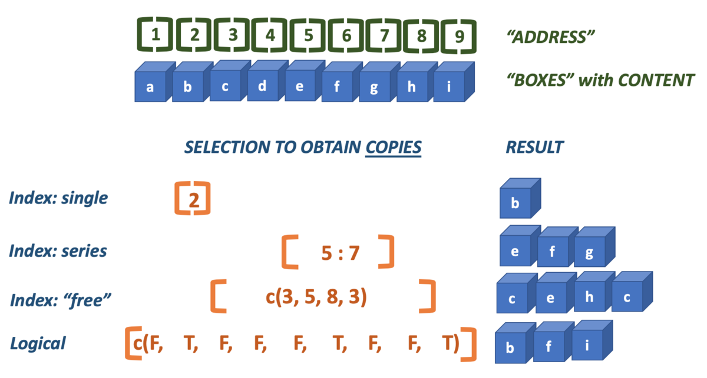

# Basic R - coding

## Vectors, fuctions and variables

### Doing Math in the console

The console is the place where you do quick calculations, tests and analyses that do not need to be saved (yet) or repeated. It is the the tab that says "Console" and on first use, R puts it in the lower left panel.

In the console, the **_prompt_** is the "greater than" symbol ">". R waits here for you to enter commands. When the panel has "focus" the cursor is blinking on and off. You can use the console as a calculator. It supports all regular math operations, in the way you would expect them:

`+` &emsp;: 'plus', as in 2 + 2 = 4  

`- `&emsp;: 'subtract', as in 2 - 2 = 0  

`*` &emsp;: 'multiply', as in 2 * 3 = 6  

`/` &emsp;: 'divide', as in 8 / 4 = 2  

`^` &emsp;: 'exponent', as in 2^3 = 8. In R, `^` is synonym of `**`

For the square root you can use $n^{0.5}$: `n**0.5`, or the function `sqrt()` (discussed later).  

When Enter is pressed when the mathematical statement is not complete yet, the `>` symbol is replaced by a `+` at the start of the new line, indicating the statement is a continuation. Here is an example:

```
> 1 + 3 + 4 + 
+ 
```
So the `+` at the start of line 2 is not a mathematical `+` but a "continuation symbol". You can always abort the current statement by pressing Escape.

When a statement _is_ complete, the result will be printed in the next line:

```
> 31 + 11
[1] 42
```

The result is of course `42`; the leading `[1]` is the **_index_** of the result. We will address this later. 

#### Operator Precedence {-}

All "operators" adhere to the standard mathematical **precedence** rules (PEMDAS):

```
    Parentheses (simplify inside these)
    Exponents
    Multiplication and Division (from left to right)
    Addition and Subtraction (from left to right)
```

With complex statements you should be aware of operator precedence! If you are not sure, or want to make your expression less ambiguous you should simply use parentheses `()` because they have highest precedence.

Besides math operators, R knows a whole set of other operators. They will be dealt with later in this chapter.

>**_Programming Rule_** Always place spaces around both sides of an operator, with the exception of `^` and `**`.

### An expression dissected

When you type `21 / 3` this called an **_expression_**. The expression has three parts: an operator (`/` in the middle) and two operands. The left operand is `21` and the right operand is `3`.  
Since there is no assignment, the result of this expression will be send to the console as output, giving `[1] 7`.  

Because this expression is the sole contents of the current line in the console, it is also called a **_statement_**.

>**_Statement vs expression_** A statement is a complete line of code that performs some action, while an expression is any section of code that evaluates to a value.

#### Ending statements {-}

In R, the newline (enter) is an end-of-statement character. Optionally you can end statements with a semicolon ";". However, when you have more statements on a single line they are mandatory is in this example:

```{r basics-semicolon}
x <- c(1, 2, 3); x; x <- 42; x
```

>**_Programming Rule_**: Have one statement per line and don't use semicolons


#### Comments {-}

Everything on a line after a hash sign "`#`" will be ignored by R. Use it to add explanation to your code:

```{r comments}
## starting cool analysis
x <- c(T, F, T) # Creating a logical vector
y <- c(TRUE, FALSE, TRUE) # same
```


### Functions

Simple mathematics is not the core business of R.  

Going further than basic math, you will need functions, mostly pre-existing functions but often also custom functions that you write yourself. Here is a definition of a function:  

>_A function is a piece of functionality that you can execute by typing its name, followed by a pair of parentheses. Within these parentheses, you can pass data for the function to work on. Functions often, but not always, return a value_.

Function usage -or a **_function call_**- has this general form:
$$function\_name(arg_1, arg_2, ..., arg_n)$$

#### Example: Square root with `sqrt()` {-}

You have already seen that the square root can be calculated as $n^{0.5}$.
However, there is also a function for it: `sqrt()`. It **_returns_** the square root of the given **_parameter_**, a number, _e.g._ `sqrt(36)` 

```{r sqrt-demo, results = 'hold'}
36^0.5
sqrt(36)
```

#### Another example: `paste()` {-} 

The `paste()` function can take any number of arguments and returns them, combined into a single text (character) string. You can also specify a separator using `sep="<separator string>"`:

```{r paste-demo}
paste(1, 2, 3, sep = "---")
```

Note the use of quotes surrounding the dashes: `"---"`; they indicate it is text, or character, data.  
Also note the use of a name for only the last argument. Not all arguments can be specified by name, but when possible this has preference, as in `sep = "---"`. 

#### Getting help on a function

Type `?function_name` or `help(function_name)` in the console to get help on a function. The function documentation will appear in the panel containing the `Help` tab, Its location is dependent on your set of preferences.  
For instance, typing `?sqrt` will give the help page of the square root function together with the `abs()` function.  
R help pages always have the exact same structure:  

- Name & package (e.g. `{base}`)
- Short description
- Description
- Usage
- Arguments
- Details
- ...
- Examples

Scroll down in the help to see example usages of the function. Alternatively, type `example(sqrt)` in the console to have all examples executed in order, until you press Escape.


### Variables

In math and programming you often use variables to label or name pieces of data, or a function in order to have them reusable, retrievable, changeable. 

>A **_variable_** is a named piece of data stored in memory that can be accessed via its name

For instance, `x = 42` is used to define a variable called `x`, with a value attached to it of `42`. Variables are really _variable_ - their value can change!
In R you usually assign a value to a variable using "`<-`", so "`x <- 42`" is equivalent to "`x = 42`". Both will work in R, but the "arrow" notation is preferred.

### Vectors

### R is completely vector-based

In R, _**all data lives inside vectors**_. When you type '2 + 4', R will execute the following series of actions:  

1. create a vector of length 1 with its element having the value 2
2. create a vector of length 1 with its element having the value 4
3. add the value of the second vector to ALL the values of vector one, and recycle any shorter vector as many times as needed  

Step 3 is a crucial one. It is essential to grasp this aspect in order to understand R. Therefore we'll revisit it later in more detail.


#### The atomic datatypes

R knows five basic types of data; other datatypes are build by combining these into more complex structures (discussed in a later chapter):

```{r datatypes-listing, echo = FALSE}
types <- data.frame(type = c("numeric", "integer", "logical", "character", "factor"),
                    descripton = c("numbers with a decimal part", "numbers without a decimal part",
                                   "Boolean values: yes/no)", 
                                   "text, should be put within quotes",
                                   "nominal and ordinal scales"),
                    examples = c("`3.123`, `5000.0`, `4.1E3`", "`1`, `0`, `2999`"
                                 , "`true` `false`", "`'hello R'` `\"A cat!\"`", "\\<dealt with later\\>"))
knitr::kable(types)
```

All these types are created in similar ways and can often be converted into other types.

**Note 1:** If you type a number in the console, it will always be a `numeric` value, decimal part or not.  
**Note 2:** For character data, single and double quotes are equivalent but double are preferred; type `?Quotes` in the console to read more on this topic.  
**Note 3:** There are also date/time types but they are not discussed here


#### Creating vectors

You will see shortly that there are many ways to create vectors: a custom collection, a series, a repetition of a smaller set, a random sample from a distribution, etc. etc.

The simplest way  to create a vector is the first: create a vector from a custom set of elements, using the "Concatenate" function `c()`. The `c()` function simply takes all its arguments and puts them behind each other, in the order in which they were passed to it, and returns the resulting vector.

```{r simple-vectors, prompt = TRUE}
c(2, 4, 3)
c("a", "b", c("c", "d"))
c(0.1, 0.01, 0.001)
c(T, F, TRUE, FALSE) # There are two way to write logical values
```


#### Vectors can hold only one data type {-}

A vector can hold only one type of data. Therefore, if you pass a mixed set of values to the function `c()`, it will **coerce** all data into one type. The preferred type is numeric. However, when that is not possible the result will most often be a character vector. In the example below, two numbers and a character value are passed. Since `"a"` cannot be coerced into a numeric, the returned vector will be a character vector.


```{r character-coersion}
c(2, 4, "a") 
```

Here are some more coercion examples.

```{r coersion-examples, prompt = TRUE}
c(1, 2, TRUE) # To numeric
c(TRUE, FALSE, "TRUE") # To character
c(1.3, TRUE, "1") # To character
```

Using the function `class()`, you can get the data type of any value or variable.

```{r data-types-demo, prompt = TRUE}
class(c(2, 4, "a"))
class(1:5)
class(c(2, 4, 0.3))
class(c(2, 4, 3))
```


### Vector fiddling

#### Vector arithmetic {-}

Let's have a look at what it means to work with vectors, as opposed to singular values (also called _scalars_). An example is probably best to get an idea. 

```{r vector_arithmetic1, results = "hold"}
x <- c(2, 4, 3, 5)
y <- c(6, 2)
x + y
```

As you can see, R works **_set based_** and will **_cycle_** the shorter of the two operands to deal with all elements of the longer operand. How about when the longer one is not a multiple of the shorter one?

```{r vector_arithmetic2, warning=TRUE}
x <- c(2, 4, 3, 5)
z <- c(1, 2, 3)
x - z
```

As you can see this generates a warning that "longer object length is not a multiple of shorter object length". However, R will proceed anyway, cycling the shorter one. 

### Other operators

Here is a complete listing of operators in R. Some operators such as `^` are _unary_, which means they have a single _operand_; a single value or they operate on. On the other hand, _binary_ operators such as `+` have two _operands_.

The following unary and binary operators are listed in precedence groups, from highest to lowest. Many of them are still unknown to you of course. We will encounter most of these along the way as the course progresses, starting with a few in this section.

```{r operators-listing, echo = FALSE}
operators <- read.table("data/operators.txt", sep = ";", header = TRUE)
knitr::kable(operators)
```

The `<<-` assignment operator is the same as `<-` but assigns to a variable in the Global environment.

#### Logical operators

Logical operators are used to evaluate and/or combine expressions that result in a single logical value: `TRUE` or `FALSE`. The **_comparison operators_** compare two values (numeric, character - any type is possible) to get to a logical value, but always set-based! In the following chunk, each of the values in `x` is considered and if it is smaller than or equal to the value `4`, `TRUE` is returned, else `FALSE`.

```{r logical-operators-ex}
x <- c(1, 5, 4, 3)
x <= 4
```

Other comparison operators are `<` (less then), `<=` (less then or equal to), `>` (greater then), `>=` (greater then or equal to), and `==` (equal to).

Another category of logical operators is the set of **_boolean operators_**. These are used to _reduce_ two logical values into one. These are 

- `&`: logical "AND"; `a & b` will evaluate to `TRUE` only if `a` AND `b` are TRUE.   
- `|`: logical "OR"; `a | b` will evaluate to `TRUE` only if `a` OR `b` are TRUE, no matter which.
- `!`: logical -unary- "NOT"; negates the right operand: `! a` will evaluate to the "flipped" logical value of `a`. 

Here is a more elaborate example combining comparison and boolean operators.
Suppose you have vectors a and b and you want to know which values in `a` are greater than in `b` and also smaller than `3`. This is the expression used for answering that question.

```{r operator-example}
a <- c(2, 1, 3, 1, 5, 1)
b <- c(1, 2, 4, 2, 3, 0)
a > b & a < 3 ## returns a logical vector with test results
```

Here is a special case. Can you figure out what happens there?

```{r operators-special-case}
6 - 2 : 5 < 3
```


#### Calculations with logical vectors {-}

Quite often you want to know how many cases fit some condition. A convenient thing in that case is that logical values have a numeric counterpart or "hidden face": 

* TRUE == 1
* FALSE == 0
    
The `sum()` function is often used on this feature:
    
```{r logical_math, results='hold'}
x <- c(2, 4, 2, 1, 5, 3, 6)
x > 3 ## which values are greater than 3?
sum(x > 3) ## how many are greater than 3?
```


#### Modulo: `%%`

The modulo operator gives the remainder of a division. 

```{r modulo-demo, results='hold'}
10 %% 3
4 %% 2
11 %% 3
```

The modulo is most often used to establish periodicity: `x %% 2` is zero for all even numbers. Likewise, `x %% 10` will be zero for every tenth value.

#### Integer division `%/%` and rounding

The integer division is the complement of modulo and gives the integer part of a division, it simply "chops off" the decimal part.

```{r integer-division-demo, results='hold'}
10 %/% 3
4 %/% 2
11 %/% 3
```

Note that `floor()` does the same. In the same manner, `ceiling()` rounds up to the nearest integer, no matter how large the decimal part. Finally, there is the `round()` method to be used for - well, rounding. Be aware that rounding in R is not the same as rounding your course grade which always goes up at `x.5`. Rounding `x.5` values mathematically goes to the nearest even number:

```{r rounding-demo}
x <- c(0.5, 1.5, 2.5, 3.5, 4.5, 5.5, 6.5, 7.5)
round(x, 0)
```

#### The `%in%` operator

The `%in%` operator is very handy when you want to know if the elements of one vector are present in another vector. An example explains best, as usual:

```{r in-test-demo, results='hold'}
a <- c("one", "two", "three")
b <- c("zero", "three", "five", "two")
a %in% b
b %in% a
```

There is no positional evaluation, it simply reports if the corresponding element in the first is present _anywhere_ in the second.


### Selecting vector elements

You often want to get to know things about specific values within a vector  

- what value is at the third position?
- what is the highest value?
- which positions have negative values?
- what are the last 5 values?

There are two principal ways to do this: through indexing with positionional reference ("addresses") and through logical indexing.

Here is a picture that demonstrates both.




The `index` is the position of a value within a vector. R starts at one (1), and therefore ends at the length of the vector. Brackets `[]` are used to specify one or more indices that should be selected (returned).

Here are two examples of straightforward indexing, selecing a single or a series of elements.

```{r indexing-1}
x <- c(2, 4, 6, 3, 5, 1)
x[4] ## fourth element
x[3:5] ## elements 3 to 5
```

However, the technique is much more versatile. You can use indexing to select elements multiple times and thus create copies of them, or select elements in any order you desire. 

```{r indexing-2}
x[c(1, 2, 2, 5)] ## elements 1, 2, 2 and 5
x <- c(2, 4, 6, 3, 5, 1)
```

Besides integers you can use logicals to perform selections:

```{r logical-indexing}
x[c(T, F, T, T, T, F)]
```

As with all vector operations, shorter vectors are cycled as often as needed to cover the longer one:

```{r indexing-cycling}
x[c(F, T, F)]
```

In practice you won't type literal logicals very often; they are ususaly the result of some comparison operation. Here, all even numbers are selected because their modulo will retun zero.

```{r modulo-indexing}
x[x %% 2 == 0]
```

And all of the maximum values in a vector are retreived:

```{r max-indexing}
x <- c(2, 3, 3, 2, 1, 3)
x[x == max(x)]
```

There is a caveat in selecting the last _n_ values: the colon operator has highest precedence!
Here, the last two elements are (supposed to be selected).

```{r indexing-3}
x <- c(2, 4, 6, 3, 5, 1)
x[length(x) - 1 : length(x)] #fails
x[(length(x) - 1) : length(x)] ## parentheses required!
```

#### Use `which()` to get an index instead of value {-}

The function `which()` returns indices for which the logical test evaluates to `true`:

```{r which-demo}
which(x >= 2) ## which positions have values 2 or greater?
which(x == max(x)) ## which positions have the maximum value?
```


### Vector creation methods

Since vectors are the bricks with which _everything_ is built in R, there are many, many ways to create them. Here, I will review the most important ones.

#### Method 1: Constructor functions {-}

Often you want to be specific about what you create: use the class-specific constructor **OR** one of the conversion methods. Constructor methods have the name of the type. They will create and return a vector of that type wit as length the number that is passed as constructor argument: 

```{r creating-types, results='hold'}
integer(4)
character(4)
logical(4)
```


#### Method 2: Conversion functions {-}

Conversion methods have the name `as.XXX()` where XXX is the desired type. They will attempt to coerce the given input vector into the requested type.

```{r converting-types, results='hold'}
x <- c(1, 0, 2, 2.3)
class(x)
as.logical(x)
as.integer(x)
```

But there are limits to coercion: R will not coerce elements with types that are non-coercable: you get an `NA` value.

```{r coercion, warning=TRUE}
x <- c(2, 3, "a")
y <- as.integer(x)
class(y)
y
```


#### Method 3: The colon operator {-}

The colon operator (**`:`**) generates a series of integers fromthe left operand to -and including- the right operand.

```{r colon-vector, results='hold'}
1 : 5
5 : 1
2 : 3.66
```


#### Method 4: The `rep()` function {-}

The `rep()` function takes three arguments. The first is an input vector. The second, `times =`, specifies how often the _entire_ input vector should be repeated. The second argument, `each =`, specifies how often _each_ individual element from the input vector should be repeated. When both arguments are provided, `each =` is evaluated first, followed by `times =`.

```{r rep_vector}
rep(1 : 3, times = 3)
rep(1 : 3, each= 3)
rep(1 : 3, times = 2, each = 3)
```


#### Method 5: The `seq()` function {-}

The `seq()` function is used to create a numeric vector in which the subsequent element show sequential increment or decrement. You specify a range and a step which may be neative if the range end (`to = `) is lower than the range start (`from = `).

```{r seq_vector, prompt = TRUE}
seq(from = 1, to = 3, by = .2)
seq(1, 2, 0.2) # same
seq(1, 0, length.out = 5)
seq(3, 0, by = -1)
```


#### Method 6: Through vector operations {-}

Of course, new vectors, often of different type, are created when two vectors are combined in some operation, or a single vector is processed in some way.

This operation of two numeric vectors results in a logical vector:

```{r derived-vector}
1:5 < c(2, 3, 2, 1, 4)
```

And this `paste()` call results in a character vector:

```{r paste-to-character}
paste(0:4, 5:9, sep = "-")
```

### Matrices are vectors with dimensions

We will not detail on them in this course, only this one small paragraph. This does not mean they are not important, but they are just not the focus here. Some functions require or return a matrix so you should be aware of them.


```{r matrix_demo}
m <- matrix(1:10, nrow = 2, ncol = 5) 
m
v <- 1:10
dim(v) <- c(2, 5)
v
```

You can convert to and from dataframes using `as.data.frame()` and `as.matrix()`. From and to simple vectors is removing or adding dimension attributes: `dim(m) <- NULL`.  


## R embedded plot types (optional) {#base_plotting}

:::info
This section is included for completeness' sake. The base plotting system can be considered deprecated.  
You should preferably use the `ggplot2` package for plotting.
:::


Looking at numbers is boring - people want to see pictures! Doing analyses without visualizations is like only listening to a movie.

There are a few plot types supported by base R that deal with (combinations of) vectors:  

- scatter (or line-) plot
- barplot
- histogram
- boxplot

We'll only look at the bare basics in this chapter because we are going to do it for real with package `ggplot2` in the next course. 


### Scatter and line plots

Meet `plot()` - the workhorse of R plotting.

```{r plot-hello-1, out.width='80%', fig.asp=.75, fig.align='center', fig.cap='Here is a nice figure!'}
time <- c(1, 2, 3, 4, 5, 6)
response <- c(0.09, 0.30, 0.41, 0.48, 0.72, 1.12)
plot(x = time, y = response)
```

The function plot is used here to generate a _scatter plot_. It may generae other types of figures, depending on its input as we'll see later.

#### Formula notation {-}

Instead of passing an `x =` and `y =` set of arguments, it is also possible to call the plot fuction with a **_formula notation_**:

```{r plot-hello-with-formula, out.width='80%', fig.asp=.75, fig.align='center'}
plot(response ~ time)
```

You can read `response ~ time` as _response as a function of time_. This is a nice, readable alternative in this case, but for many functions it is the only or preferred way to specify the relationship you want to investigate.

#### Plot decorations {-}

Plots should always have these decorations: 

- Axis labels indicating measurement type (quantity) and its units. E.g. '[Mg] (mq/ml)' or 'Heartrate (bpm)'.
- If multiple data series are plotted: a legend
- Either a title or a figure caption, depending on the context.

The first plots of this chapters were very bare (and a bit boring to look at): the plot has no axis labels (quantity and units) and no decoration whatsoever. By passing arguments to `plot()` you can modify or add many features of your plot. Basic decoration includes  

- adjusting markers (`pch = 19`, `col = "blue"`)
- adding connector lines (`type = "b"`) or removing points (`type = "l"`)
- adding axis labels and title (`xlab = "Time (hours)"`, `ylab = "Systemic response"`, `main = "Systemic response to agent X"`)
- adjusting axis limits (`xlim = c(0, 8)`)

This is not an exhaustive listing; these are listed in the last section of this chapter.

Here is a more complete plot using a variety of arguments.

```{r plot-hello-2, out.width='80%', fig.asp=.75, fig.align='center'}
plot(x = time, y = response, pch = 19, type = "b", xlim = c(0, 8),
     xlab = "Time (hours)", ylab = "Systemic response (a.u.)",
     main = "Systemic response to agent X", col = "blue")
```


#### Adjusting the plot symbol {-}

When you have many data points they will overlap. Using transparency with the `rgb(,, alpha=)` color definition and/or smaller plot symbols (`cex=`) solves this.

```{r plot-hello-3, out.width='80%', fig.asp=.75, fig.align='center'}
x <- rnorm(1000, 10, 2); y <- x + rnorm(1000, 0.5, 0.5)
plot(x, y, pch = 19, cex = 0.6,
     col = rgb(red = 0, green = 0, blue = 1, alpha = 0.2))
```


### Barplots

Barplots can be generated in several ways:

- By passing a factor to `plot()` - it will generate a barplot of level frequencies. This is a shorthand for `barplot(table(some_factor))`.
- By using `barplot()`. The advantage of this is that accepts some graphical parameters that are not relevant and accepted by `plot()`, such as `beside =`, `height = `, `width = ` and others (type `?barplot` to see all).

Here is an example:

```{r barplot-0, out.width='80%', fig.asp=.75, fig.align='center'}
persons <- as.factor(sample(c("male", "female"), size = 100, replace = T))
plot(persons)
```


#### `barplot()` with a vector {-}

The function `barplot()` can be called with a vector specifying the bar heights (frequencies), or a `table` object.

```{r barplot-1, out.width='80%', fig.asp=.75, fig.align='center'}
frequencies <- c(22, 54, 12, 29)
barplot(frequencies, names = c("one", "two", "three", "four"))
```

With a table object:

```{r barplot-2, out.width='80%', fig.asp=.75, fig.align='center'}
table(persons)
barplot(table(persons))
```


#### `barplot()` with a 2D table object {-}

Suppose you have this data:

```{r barplot-3,, out.width='80%', fig.asp=.75, fig.align='center'}
set.seed(1234) 
course <- rep(c("biology", "chemistry"), each = 10)
passed <- sample(c("Passed", "Failed"), size = 20, replace = T)
tbl <- table(passed, course) # the order matters!
tbl
```

The `set.seed(1234)` makes the _sampling_ reproducible, although that sounds really unlogical. Discussing **_pseudorandom_** sampling is not within the scope of this course however.

You can create a **_stacked bar chart_** like this.

```{r barplot-4, out.width='80%', fig.asp=.75, fig.align='center'}
barplot(tbl, 
        col = c("red", "darkblue"), 
        xlim = c(0, ncol(tbl) + 2), 
        legend = rownames(tbl))
```

The `xlim =` setting is a trick to get the legend beside the plot.

Using the `beside = TRUE` argument, you get the bars **_side by side_**:

```{r barplot-5, fig.height = 3.5, fig.width = 5}
barplot(tbl, 
        col=c("red", "darkblue"), 
        beside = TRUE, 
        xlim=c(0, ncol(tbl)*2 + 3), 
        legend = rownames(tbl))
```

Later, we'll see another data structure to feed to barplot: the matrix.

### Histograms

Histograms help you visualise the distribution of your data. 

```{r histogram-1, out.width='80%', fig.asp=.75, fig.align='center'}
male_weights <- c(rnorm(500, 80, 8)) ## create 500 random numbers around 80
hist(male_weights)
```

Using the `breaks` argument, you can adjust the bin width. Always explore this option when creating histograms!

```{r histogram-2, out.width='80%', fig.asp=.75, fig.align='center'}
par(mfrow = c(1, 2)) # make 2 plots to sit side by side
hist(male_weights, breaks = 5, col = "gold", main = "Male weights")
hist(male_weights, breaks = 25, col = "green", main = "Male weights")
```

If you want a more detailed 

### Density plot as alternative to `hist()`

When you want a bit more fine-grained view of the distribution you can use a plot of a density function; by adding a `polygon()` you can even have some nice shading under the line:

```{r density-plot-1, out.width='80%', fig.asp=.75, fig.align='center'}
plot(density(male_weights),
     main = "A density plot of male weights",
     col = "blue", lwd = 2)
polygon(density(male_weights), col="lightblue")
```


### Boxplots

This is the last of the basic plot types. A boxplot is a visual representation of the *5-number summary* of a numeric variable: minimum, maximum, median, first and third quartile. 

```{r summary-vs-boxplot}
persons <- rep(c("male", "female"), each = 100)
weights <- c(rnorm(100, 80, 6), rnorm(100, 75, 8))
#print 6-number summary (5-number + mean)
summary(weights[persons == "female"])
```

Boxplots tell the same story as histograms, but are less precise. however, they are excellent when you want to show a series of subsets split over some variable.

```{r boxplots-1, out.width='80%', fig.asp=.75, fig.align='center', results = "hold"}
par(mfrow = c(1, 2)) # make 2 plots to sit side by side
# create boxplots of weights depending on sex
boxplot(weights ~ persons, ylab = "weight")
boxplot(weights ~ persons, notch = TRUE, col = c("yellow", "magenta"))
```

Use `varwidth = TRUE` when you want to visualize the difference in group sizes.

### Adding more data and a legend 

When you have more than one data series to plot, add them using the function `points()`. You call this function _after_ you created the primary plot. Since there are multiple lines you will also need a legend.


```{r plot-legend-1, out.width='80%', fig.asp=.75, fig.align='center'}
response2 <- c(0.07, 0.10, 0.17, 0.28, 0.46, 0.61)
plot(x = time, y = response, pch = 19, type = "b",
     xlab = "Time (hours)", ylab = "Systemic response (a.u.)",
     main = "Systemic response to agent X", col = "blue")
points(x = time, y = response2, col = "red", pch = 19, type = "b")
legend(x = 1, y = 1.0, legend = c("one", "two"), col = c("blue", "red"), pch = 19)
```

The `legend()` function is _very_ versatile. Have a look at the docs!
In its most basic form you pass it a position (x and y), series names, colors and plot character.


### Helper lines and `lm()`

Adding helper lines can be used to aid your reader in grasping and interpreting your data story.
Use the function `abline()` for this.

There are four types of helper lines you might want to add to a figure:

- A horizontal line with `h =`: indicate some y-threshold
- A vertical line with `v =`: indicate x-threshold or mean or some other statistic
- A line with an intercept (`a =`) and a slope (`b =`): often used to indicate some expected response, or diagonal x = y
- A linear model, determined with the `lm()` function. The linear model object actually contains an intercept and a slope value which is taken by `abline()`.

In the following plot, these four basic helper lines are demonstrated:

```{r plot-helpers-1, out.width='80%', fig.asp=.75, fig.align='center'}
plot(x = time, y = response, pch = 19, type = "b",
     xlab = "Time (hours)", ylab = "Systemic response (a.u.)",
     main = "Systemic response to agent X", col = "blue")
#horizontal line
abline(h = 0.3, lty = 2, lwd = 2, col = "red")
#vertical line
abline(v = 4, lty = 3, lwd = 2, col = "darkgreen")
#line with slope
abline(a = -0.1, b = 0.3, lwd = 2, col = "purple")
#linear model 
abline(lm(response ~ time),  lwd = 2, col = "maroon")
```

### Graphical parameters to `plot()`

There are _many_ parameters that can be passed to the plotting functions. Here is a small sample and their possible values.

```{r plot-parameters-demo}
series <- 1:20
plot(0, 0, xlim=c(1,20) , ylim=c(0.5, 7.5), col="white" , yaxt="n" , ylab="" , xlab="")

# the rainbow() function gives a nice palette across all colors
# or use hcl.colors() to specify another palette
# use  hcl.pals() to get an overview of available pallettes
colors = hcl.colors(20, alpha = 0.8, palette = 'viridis')

#pch
points(series, rep(1, 20), pch = 1:20, cex = 2)
#col
points(series, rep(2, 20), col = colors, pch = 16, cex = 3)
#cex
points(series, rep(3, 20), col = "black" , pch = 16, cex = series * 0.2)

#overlay to create new symbol
points(series, rep(4, 20), pch = series, cex = 2.5, col = "blue")
points(series, rep(4, 20), pch = series, cex = 1.5, col = colors)
 
#lty
for (i in 1:6) {
    points(c(-2, 0) + (i * 3), c(5, 5), col = "black", lty = i, type = "l", lwd = 3)
    text((i * 3) - 1, 5.25 , i)
}
#type and lwd
for (i in 1:4) {
    #type
    points(c(-4, -3, -2, -1) + (i * 5), rep(6, 4),
           col = "black", type = c("p","l","b","o")[i], lwd=2)
    text((i * 5) - 2.5, 6.4 , c("p","l","b","o")[i] )
    #lwd
    points(c(-4, -3, -2, -1) + (i * 5), rep(7, 4), col = "blue", type = "l", lwd = i)
    text((i * 5) - 2.5, 7.23, i)
}
#add axis
axis(side = 2, at = c(1, 2, 3, 4, 5, 6, 7),
    labels = c("pch" , "col" , "cex" , "combine", "lty", "type" , "lwd" ),
    tick = FALSE, col = "black", las = 1, cex.axis = 0.8)
```


