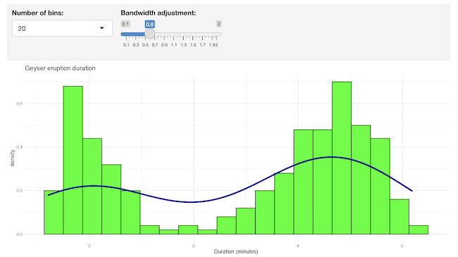
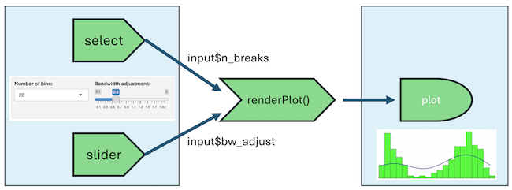
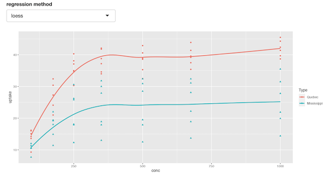
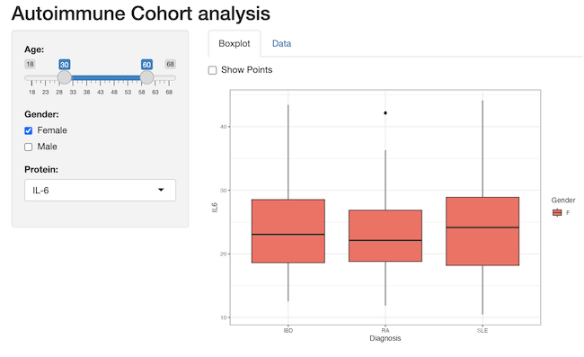

```{r interactivity-setup, include=FALSE, message=FALSE}
options(digits = 3)
knitr::opts_knit$set(cache = TRUE,
                     tidy = TRUE,
                     tidy.opts = list(blank = FALSE, width.cutoff = 60))

library(shiny)
```

# Adding interactivity

There are several ways to create interactive documents and apps using R:

- Plotly
- Shiny within RMarkdown
- Shiny apps

They are discussed here, from low to high difficulty.

## Plotly

This is the simplest form of interactivity. Note that it only works with html output.

```{r plotly, message=FALSE, warning=FALSE}
library(plotly)
plot_ly(data = iris, 
        x = ~Petal.Length, 
        y = ~Petal.Width, 
        color = ~Species, 
        type = "scatter", 
        mode = "markers")
```

Note the use of the tilde prefix with the variables (`~Petal.Length`); they are necessary in plotly, toherwise you get an error: `Error in plot_ly(...) object 'Petal.Length' not found`.  

The plot is interactive in several ways:

- you can hover points to get the values behind them
- you can zoom a part of the plot
- you can download the plot as png image

There is more; simply try it out!  

You should realise however that plotly is not (even close) as versatile and sophisticated as ggplot!

## Shiny

Shiny is an R package that provides a framework for building web applications using only the R language. Shiny helps you turn your analyses into interactive web applications without requiring HTML, CSS, or JavaScript knowledge - ideally.

Unfortunately, shiny will not run within the context of an ebook. Therefore, the code snippets below are all static examples. To see these in action, please download the markdown [here]() and run it in your own RStudio setting. The yaml header of your notebook should have this output statement: `runtime: shiny` (instead of )

All examples below assume you have installed and loaded shiny using `library(shiny)`.

### Inputs and Outputs

You can embed Shiny inputs and outputs in your document. Outputs are automatically updated whenever inputs change. 

An input is a graphical element (a widgets like a slider, a pull-down menu, or radio button) that dynamically provides input values to shiny reactive functions.  

What then, is reactivity?  
This is the paradigm that when one of the dependants of a function changes, it will be automatically triggered to run again and generate a fresh new output based on the changed input value.  

An output is on the receiving end of a reactive chain. This can be a table, or a plot, for instance.

An example explains best. The snippet below demonstrates an output ggplot2 plot that depends on two inputs: `input$n_breaks` and `$input$bw_adjust`. These inputs are created by the select box (`selectInput`) and the slider (`sliderInput`). These functions create the input widgets and place values on the `input` reactive collection. The glue between the inputs and the output is the reactive `renderPlot` function. Whenever one of the two reactive inputs changes, the function executes again and updates the plot.

**None of the examples below work in the context of this e-Book!** Please clone the repo [at github](https://github.com/MichielNoback/davur_shiny_material) holding all demo materials (notebooks and apps) that do function within RStudio.

```{r eruptions, echo=TRUE, eval=FALSE}
library(shiny)
inputPanel(
  selectInput("n_breaks", 
              label = "Number of bins:",
              choices = seq(5, 50, 5), 
              selected = 20),
  
  sliderInput("bw_adjust", 
              label = "Bandwidth adjustment:",
              min = 0.1, 
              max = 2, 
              value = 0.6, 
              step = 0.1)
)

renderPlot({
    plt <- ggplot(data = faithful,
           mapping = aes(x = eruptions)) +
        geom_histogram(mapping = aes(y = ..density..), 
                       bins = input$n_breaks,
                       fill = "green",
                       color = "black") +
        geom_density(bw = input$bw_adjust, color = "darkblue", linewidth = 1.5) +
        labs(x= "Duration (minutes)", title = "Geyser eruption duration") +
        theme_minimal()
    print(plt)
})
```

The above, when run as notebook, will yield this: 


Below is a graphical representation of the dependencies in this reactive situation.



## Inline application  

The next step up the ladder of complexity is an inline application.
It has the added advantage that you can run the chunk separately from the notebook, which is not possible with the above example.

```{r, echo=TRUE, eval=FALSE}
shinyApp(

  ui = fluidPage(
    selectInput(inputId = "method",
                label = "regression method",
                choices = c("loess", "lm", "glm")),
    plotOutput("uptake")
  ),

  server = function(input, output) {
    output$uptake = renderPlot({
        plt <- ggplot(data = CO2,
               mapping = aes(x = conc, y = uptake, color = Type)) +
            geom_point(aes(shape = Type)) + 
            geom_smooth(method = input$method, se = FALSE, formula = "y ~ x")
        print(plt)
    })
  },

  options = list(height = 400)
)
```

The above, when run as notebook, will yield this: 



Note the use of the `height` parameter to determine how much vertical space the embedded application should occupy.

## Embedded external application

Finally, it's also possible to embed an entire Shiny application within an R Markdown document using the `shinyAppDir` function. This example embeds a Shiny application located in another directory:

```{r tabsets, echo=TRUE, eval=FALSE}
shinyAppDir(
    "./autoimmune_cohort_analysis/",
    options = list(width = "100%", height = 500)
)
```

The above, when run as notebook, will yield this: 


The app could of course also have been run standalone, which is maybe more the appropriate deployment.

You can also use the `shinyApp` function to define an application inline rather then in an external directory.

In all of R code chunks above the `echo = TRUE` attribute is used. You should change that to 
`echo = FALSE` if you want to prevent the R code within the chunk from rendering in the 
document alongside the Shiny components.

## More examples

There is a small [repo](https://github.com/MichielNoback/davur_shiny_material) with this notebook with working examples, as well as two small demo apps that you can inspect: app-1 and app-2.


## Mastering Shiny 

This was only skimming the subject. For further details, I suggest you start with the excellent free ebook.
[Mastering Shiny](https://mastering-shiny.org/)
