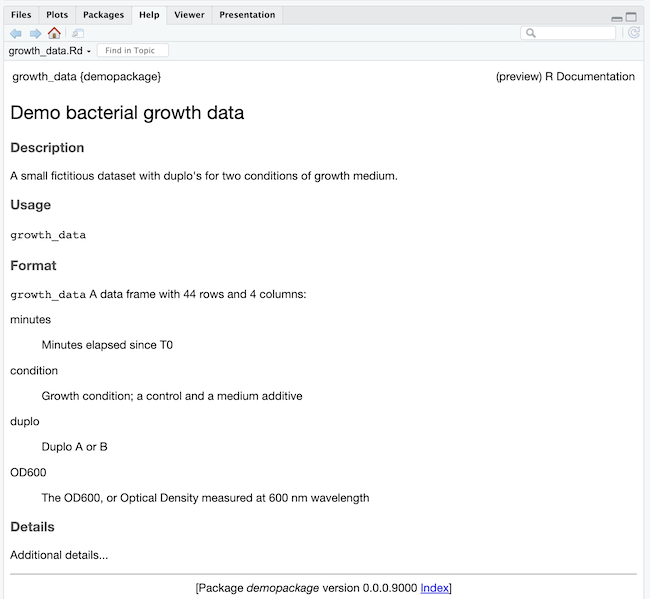
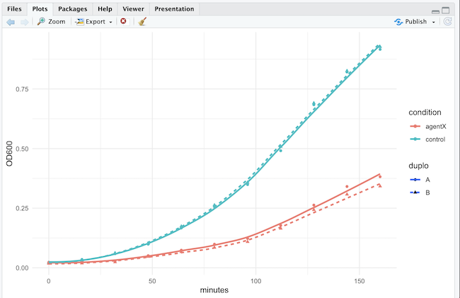

```{r package-setup, include=FALSE, message=FALSE}
knitr::opts_knit$set(cache = TRUE,
                     tidy = TRUE,
                     tidy.opts = list(blank = FALSE, width.cutoff = 60))
```

# Packages

Until now, you have probably installed and imported many R packages, but one of them your own.  
There are two main reasons why you would create your own packages:

1. You want to reuse some functions in multiple projects that you work on.
1. You want to share functions and data with a wider community, maybe with FAIR science in mind.

This chapter outlines the basic workflow for creating, developing, documenting and deploying your package.  
For a real in-depth discussion, you should read the excellent free e-Book [R Packages](https://r-pkgs.org/) by Wickham and Bryan.

## Prerequisites

You need the following packages to get started with developing your own package:

1. `devtools` which itself loads some other packages as well.
1. `usethis`

## Setting up

The `usethis` package has a convenience method to create a new package:

```{r, eval = FALSE}
usethis::create_package("demopackage")
```

Note: I use the package name prefix with two colons (`package::function()`) in this tutorial in 
order to make it clear which package I the function resides in. It is not mandatory.

The above command will create a new directory with the following structure:

```
demopackage/
    .gitignore
    .Rbuildignore
    demopackage.Rproj
    DESCRIPTION
    NAMESPACE
    R/
```

The `DESCRIPTION` file contains metadata about your package, such as the name, version, 
dependencies, and so on:

```
Package: demopackage
Title: What the Package Does (One Line, Title Case)
Version: 0.0.0.9000
Authors@R: 
    person("First", "Last", , "first.last@example.com", role = c("aut", "cre"),
           comment = c(ORCID = "YOUR-ORCID-ID"))
Description: What the package does (one paragraph).
License: `use_mit_license()`, `use_gpl3_license()` or friends to pick a
    license
Encoding: UTF-8
Roxygen: list(markdown = TRUE)
RoxygenNote: 7.2.3
```

The `NAMESPACE` file is used to define which functions are exported from your package.

```
# Generated by roxygen2: do not edit by hand
```

The `R/` directory is where you will put your R code.
The other files.folders are auto-generated and not interesting for now.

## Demo data

Many packages come with demo data that can be used to test the package.  
I think it always a good idea to include some demo data in the package, also for my own development cycle, 
so let's start with that.  

**step 1** Create folders `data/` and `/data-raw/` in the package folder. Also add `data-raw` to the `.Rbuildignore` file:  

```
^demopackage\.Rproj$
^\.Rproj\.user$
data-raw
```

**step 2** Create a new R script called `DATASET.R` in the `data-raw/` directory .

Contents of `DATASET.R`:
```{r growth-data-prep, eval = FALSE}

create_demo_data <- function() {
    time_mins <- c(0, 16, 32, 48, 64, 80, 96, 112, 128, 144, 160)
    OD600_A1 <- c(0.023, 0.035, 0.059, 0.099, 0.167, 0.256, 0.349, 0.491, 0.684, 0.821, 0.916)
    OD600_A2 <- c(0.022, 0.031, 0.062, 0.103, 0.174, 0.263, 0.358, 0.508, 0.691, 0.826, 0.927)

    OD600_B1 <- c(0.023, 0.022, 0.027, 0.051, 0.074, 0.099, 0.123, 0.178, 0.263, 0.341, 0.382)
    OD600_B2 <- c(0.018, 0.019, 0.024, 0.047, 0.067, 0.085, 0.109, 0.165, 0.243, 0.308, 0.342)

    data <- data.frame(minutes = time_mins,
                       OD600_control_A = OD600_A1,
                       OD600_control_B = OD600_A2,
                       OD600_agentX_A = OD600_B1,
                       OD600_agentX_B = OD600_B2)

    growth_data <- tidyr::pivot_longer(data = data,
                       cols = 2:5,
                       names_to = c("condition", "duplo"),
                       names_pattern = "OD600_(control|agentX)_(A|B)",
                       values_to = "OD600")

    usethis::use_data(growth_data, overwrite=TRUE)
}

create_demo_data()
```

**Step 3** Run the above script in the console of RStudio. 

Note the call of `usethis::use_data(growth_data, overwrite=TRUE)` at the end of the function. 
This takes care of creating the `growth_data.rda` R data object in `data/` that will be published with you package. 

I used the `tidyr::pivot_longer` function to transform the data from wide to long format.

Run `devtools::load_all()` in the console of RStudio to load the package into the current R session.
Output will be something like:

``` 
ℹ Loading demopackage
✔ Saving 'growth_data' to 'data/growth_data.rda'
• Document your data (see 'https://r-pkgs.org/data.html')
```

**Do not ignore warnings!** The warning about documenting your data is important.

Now, when you type in the console `growth_data`, or `demopackage::growth_data`, 
you will see the data object printed to the console.

```
# A tibble: 44 × 4
   minutes condition duplo OD600
     <dbl> <chr>     <chr> <dbl>
 1       0 control   A     0.023
 2       0 control   B     0.022
 3       0 agentX    A     0.023
 4       0 agentX    B     0.018
 5      16 control   A     0.035
 6      16 control   B     0.031
 7      16 agentX    A     0.022
 8      16 agentX    B     0.019
 9      32 control   A     0.059
10      32 control   B     0.062
# ℹ 34 more rows
# ℹ Use `print(n = ...)` to see more rows
```

You may have noticed the `• Document your data (see 'https://r-pkgs.org/data.html')` 
in the `load_all()` output above.
Let's proceed with that, following the guidelines mentioned in the link.

First, create a new R script in the `R/` directory called `data.R`.  
In it, put the documentation of your dataset, followed by its -quoted- name:

```{r data-documentation, eval=FALSE}
#' Demo bacterial growth data
#'
#' A small fictitious dataset with duplo's for two conditions of growth medium.
#'
#' @format ## `growth_data`
#' A data frame with 44 rows and 4 columns:
#' \describe{
#'   \item{minutes}{Minutes elapsed since T0}
#'   \item{condition}{Growth condition; a control and a medium additive}
#'   \item{duplo}{Duplo A or B}
#'   \item{OD600}{The OD600, or Optical Density measured at 600 nm wavelength}
#' }
#' @details
#' Additional details...
#'
"growth_data"
```

The documentation is written in Roxygen2 format, which is a way to write documentation in the source code of your package.
The `roxygen2` package will parse this and create the documentation for you.  
The `@export` tag at the end is used to indicate that this dataset is meant to be used by the users of your package. 

To make this available, we first call `devtools::document()` and then type `?growth_data` in the console to see the documentation.
It looks like this:



Your package folder now has an additional folder `man` with a file `growth_data.Rd` in it; 
the same documentation, but now in Latex format. This is the file that contains the documentation 
that you just wrote.  
Here is the current status of the project folder.  

```
demopackage/
    .gitignore
    .Rbuildignore
    demopackage.Rproj
    DESCRIPTION
    NAMESPACE
    data/
        growth_data.rda
    data-raw/
        DATASET.R
    man/
        growth_data.Rd
    R/
        data.R
```

## Writing functions

Let's add some functionality to the package.  
A warning: Do not use `library(package)` statements in your package scripts; they should be dealt with in another way.

Create a new R script in the `R/` directory called `plot_growth_curves.R`.
In it, put the following function:

```{r growth-functions, eval=FALSE}
plot_growth_curves <- function(growth_data, add_smoother=FALSE) {
    plt <- ggplot2::ggplot(data = growth_data,
                           mapping = ggplot2::aes(x = minutes,
                                         y = OD600,
                                         linetype = duplo,
                                         shape = duplo,
                                         color = condition)) +
           ggplot2::geom_point() +
           ggplot2::theme_minimal()
    if (add_smoother) {
        plt <- plt + ggplot2::geom_smooth(se = F, formula = 'y ~ x', method = "loess")
    }
    print(plt)
}
```

and don't forget to add the dependency on the two tidyverse packages in the `DESCRIPTION` file:

```
Imports: 
    tidyr,
    ggplot2
```

In this example, I always use the `ggplot::` prefix. This is the easiest way to use dependencies. 
If you don't want this (because it is a bit verbose), you can use `importFrom` in the `NAMESPACE` file. 
See details for this in the [R Packages](https://r-pkgs.org/) book.

Now, after `devtools::load_all()` we can use the package function:

```{r plot-growth-curves, eval=FALSE}
demopackage::plot_growth_curves(demopackage::growth_data)
#OR
plot_growth_curves(growth_data)
```

Let's finish with the function documentation:

```{r plot-growth-curves-documentation, eval=FALSE}
#' Plot bacterial growth data
#'
#' Plots bacterial growth curves with duplos and multiple conditions.
#'
#' @param growth_data A tibble of data frame in long format, similar to the growth_data demo table of this package.
#' @param add_smoother A logical indicating whether to add a smoother to the plot.
#' @returns Nothing
#' @examples
#' plot_growth_curves(growth_data)
#' plot_growth_curves(growth_data, add_smoother = TRUE)
#' @details
#' Additional details...
#'
#' @export
```

Finally, run `devtools::document()` and `devtools::load_all()` to test the function and its documentation.



I know, this smoother is not the most appropriate fit for this type of data, but couldn't be bothered 
to find a better one for this example.  

Finally, let's update the `DESCRIPTION` file with the new function and its documentation:
The DESCRIPTION file should now look something like this:

```
Package: demopackage
Title: A package for plotting bacterial growth curves.
Version: 0.0.1.000
Authors@R: 
    person("Michiel", "Noback", , "michiel.noback@example.com", role = c("aut", "cre"))
Description: A package for plotting bacteria growth curves in a user-friendly way.
License: `use_mit_license()`
Encoding: UTF-8
Roxygen: list(markdown = TRUE)
RoxygenNote: 7.2.3
Imports: 
    tidyr,
    ggplot2
Depends: 
    R (>= 2.10)
LazyData: true
```

and the NAMESPACE file should look like this (DON'T EDIT THIS FILE BY HAND):

```
# Generated by roxygen2: do not edit by hand

export(plot_growth_curves)
```

The dataset `growth_data` is not present in the NAMESPACE file. Datasets are dealt with in a different way by R.


## Publish the package

If you want to share your package with the world, you can publish it on GitHub, or on CRAN.

CRAN has a lot of rules and guidelines that you need to follow; I won't go into that here.

For GitHub, you can use the `usethis::use_github()` function, but I prefer to take matters in my own hands.

These are the steps:

1. Add a `.gitignore` file to your package folder with `usethis::use_git_ignore()`. It should have the entries `.Rproj.user`, `*.Rproj` and `.Rhistory`
1. Init a github repository in your package folder with `git init`.
1. Create a new repository on GitHub (in my case [https://github.com/MichielNoback/R-demo-package](https://github.com/MichielNoback/R-demo-package)).
1. Add the remote with `git remote add origin` and the URL of your repository.
1. Add a Readme.md; you can create a stub file with `usethis::use_readme_md()`. Don't forget to edit it!
1. `git add`, `git commit` and `git push` to the remote.


Here is the final status of the project folder.  

```
demopackage/
    .git/
    .Rproj.user/
    data/
        growth_data.rda
    data-raw/
        DATASET.R
    man/
        growth_data.Rd
        plot_growth_curves.Rd
    R/
        data.R
        plot_growth_curves.R
    .gitignore
    .Rbuildignore
    .Rhistory
    demopackage.Rproj
    DESCRIPTION
    NAMESPACE
    README.md
```


Others can now install this package with `devtools::install_github("MichielNoback/R-demo-package")`.
